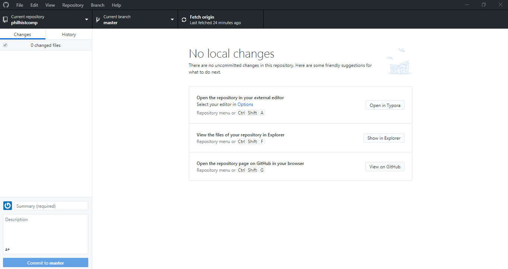
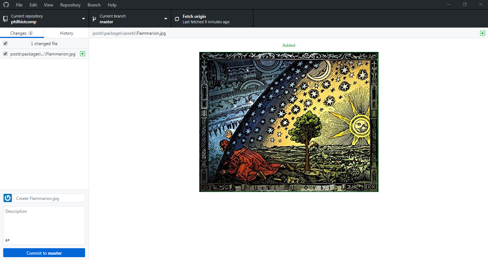
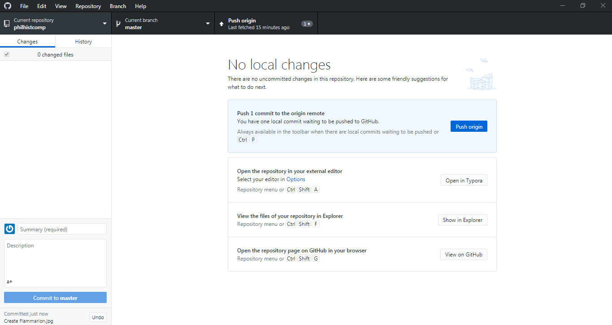

#### PHILOSOPHY AND HISTORY OF SCIENCE WITH COMPUTATIONAL MEANS

##### PROF. DR. GERD GRAßHOFF 

# GitHub Overview

GitHub provides hosting for open source projects. In case you are having issues with GitHub, here you can find an overview. 

The first step is to install GitHub Desktop (with your E-Mail you get a GitHub account) and then you have to clone the repository of the seminar (Current repository &rightarrow; Add &rightarrow; Clone repository... &rightarrow; URL): https://github.com/grasshoff/philhistcomp

For Linux Users see: https://www.youtube.com/watch?reload=9&v=Ed_k_pZ4LoY

On the repository of the seminar we can commit our projects for the Jupyter Notebooks. In this way, we are going to be able to view our projects and help each other. Basically, you work from your computer and push your files to GitHub, so that we can commit changes from our files to the cloud.

If you open GitHub Desktop you will see something like this:

Notice that it says "No local changes" and on the left "0 changed files." Let's look at how does it work. Depending on the editor that you use, you can select your editor. With "Atom" you can also integrate the files of the repository inside the editor. Or you can view the files of the repository in Explorer, click on "Show in Explorer" ("Show in Finder" for MacOs).

On the repository you can add a sub-directory to "projects" for your project with your files and later make any changes to your work.

For example, I added a picture to the repository. Back at the GitHub Desktop, I get a change listed and it shows it too:

Now we have to click there where it says "Commit to master," but first give to the change a title where it says "Summary (required)" (an optional description), and now this is what happens:

Lastly, click on "Push origin." You will notice that if you open the repository page on GitHub in your browser, all the changes are there.

