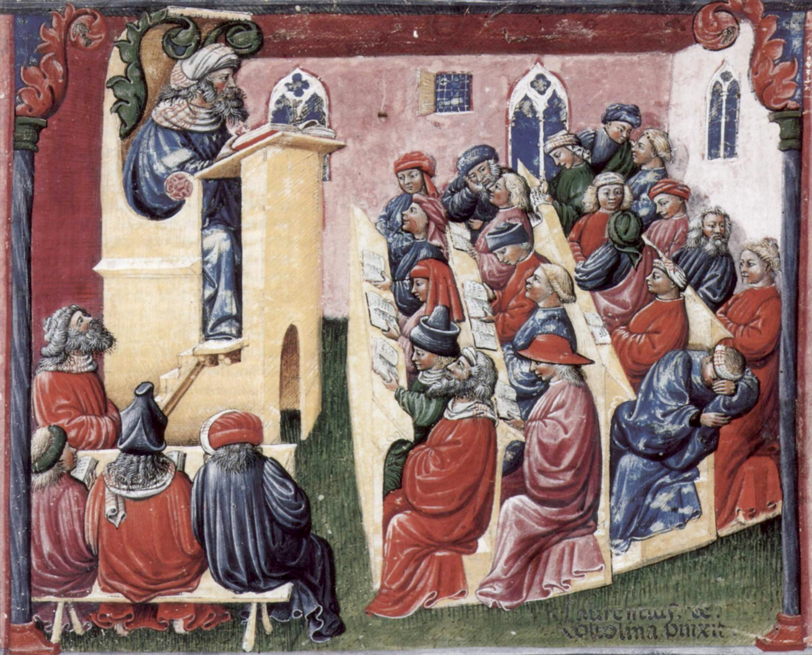

# New Traditions, New Ideas? An Investigation on the Terminological Continuity in the History of Philosophical Ideas (working title)

# Background
Descartes is commonly conceived as the founding father of modern philosophy, a new era in the history of philosophy which put an end to the scholastic tradition of medieval thinkers. This view, however, has recently been challenged by Dominik Perler who claims that in spite of Descartes' attempt to overcome scholastic theories of mind such as Francisco Suárez's account, he nevertheless remains in the medieval paradigm. This is because, according to Perler, Descartes' seemingly new approach to the theory of mind does in fact draw on the work of William of Ockham, i.e. yet another medieval scholar.

As a consequence, this assumption gives rise to a much more continuous, and thus more differentiated, perspective on the history of philosophy by devaluating the role usually attributed to the 'great thinkers' such as Descartes. In other words, it opens up the possibility to rethink the history of philosophy by considering Descartes only as one - nonetheless highly important - contributer to the *progressive* development from medieval to early modern philosophy.

# Research Object
The present investigation aims at re-evaluating the role of Descartes' work in the transition from scholasticism to modern philosophy by applying computational means to the field of the history of ideas. To do so, texts from Descartes, Ockham and Suárez (and maybe some other pre-cartesian philosophers; as well as post-cartesian writers as 'control group'?) are going to be compared with respect to the amount of recurrent philosophical terminology, i.e. a set of terms which has still to be defined. The analysis thus amounts to an empirical verification of Perler's argument according to which Descartes' thinking is still heavily influenced by the scholastic tradition - a claim that ultimately casts doubt on the dominant view of the French philosopher as the founding father of modern philosophy.

# Research Question
The principal question which led to the present investigation can be summarised as follows: are different philosophical traditions (or eras) distinguishable by the terminology used by the main protagonists of that tradition? Or, in other words, are the ideas and concepts - expressed by means of a certain language, i.e. terms - of a philosophical traditon the very glue that holds together, or maybe even constitutes, this very tradition as a unit? And if so, does a large-scale anaylsis of the terminology used at different moments in the history of philosophy lead to the discovery of new connections which force us into giving up long established distinctions?

Admittedly, this research question is too broad (and too ambitious) to be trated by a single investigation, which is why - as already indicated - its scope is going to be reduced to comparing the terminological continuity between some important scholastic thinkers and the work of René Descartes.

# Empirical Sources

[Plain-text version of the Gutenberg Project](https://github.com/aparrish/gutenberg-dammit) provided by Allison Parrish (I still have to figure out how to use Phython to work with the zip file). Even if the file does not contain the texts I am looking for, it should not be too difficult to find them as the copyright of medieval and early modern texts has obvisously expired.

# Methodological Concerns
New ideas do not always come along with the use of a new terminology: possibility of expressing new ideas with old terms and old ideas with new terms. Reducing 'ideas' to 'terms' might thus not be a perfectly adequate method to 'operationalise' the current research question - or at least raise some limitations with respect to the interpretation of the results.

# Directions for Future Research
The historical line drawn between medieval and (early) modern philosophy is only one example of the historians' tendency to divide the continuous development of philosophy into distinct periods, each of them having a definite beginning and ending. Hence, future research could apply the method developed in here to other distinctions in the history of philosophy such as Pre- and Post-Socratic philosophy or British Idealism (e.g. Bradley, McTaggart) and Analytic Philosophy (e.g. Russell, Wittgenstein).

# Literature
Dominik Perler, "What are Faculties of the Soul? Descartes and his Scholastic Background", in: John Marenbon, *Continuity and Innovation in Medieval and Modern Philosophy: Knowledge, Mind and Language*, Oxford, OUP, 2013.

Dominik Perler, "Classifying the Passions:	Descartes	and	His	Scholastic	Background",	in: Belgioioso & Carraud (eds.), *Les	passions	de l’âme*, Turnhout: Brepols	(forthcoming, maybe I can get a copy of the draft, if not, then the first reference should still be enough).

René Descartes, ...

William of Ockham, ...

Francisco Suárez, ...

*maybe also useful*: Michel Foucault, L'archéologie du savoir *and/or* Patrick Boucheron, L'histoire mondiale de la France (analogously to Boucheron's method of rejecting the importance commonly attributed to the 'big events' of (French) history in favour of a more differentiated and continuous 'story-telling', rejecting the importance of Descartes as 'the founding father' of modern philosophy in favour of a more continuous perspective on the history of philosophy. However, I have not yet looked into this in more detail so I might be totally wrong, i.e. the 'analogy' might turn out to be overly simplistic...)
